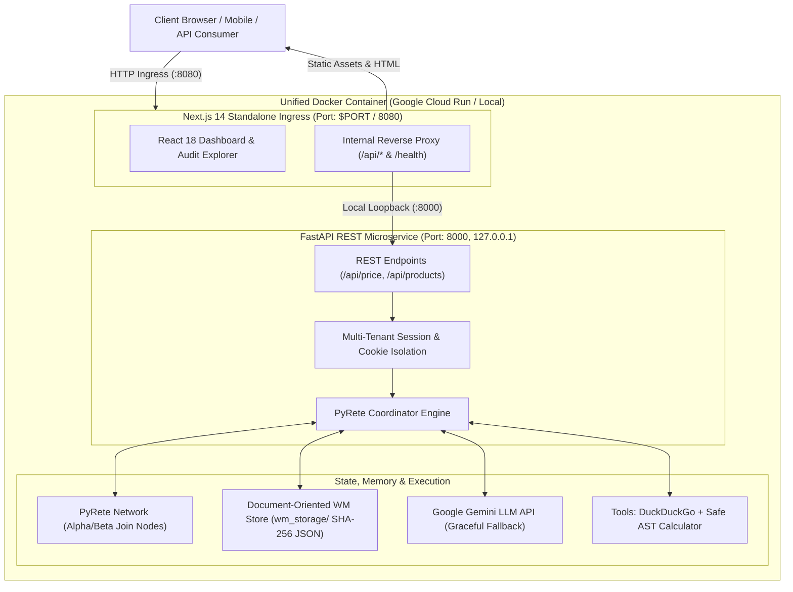

# PyRete ReAct Hardware Pricing Coordinator

[](https://fastapi.tiangolo.com/)
[-green.svg)](https://github.com/cmaclell/py_rete)
[-black.svg)](https://nextjs.org/)
[-teal.svg)](https://fastapi.tiangolo.com/)
[](https://cloud.google.com/run)
[](LICENSE)

An enterprise-grade reference architecture demonstrating the convergence of **Deterministic Business Rules Engines (BRE)** and **Probabilistic Large Language Models (LLMs)**. Built upon the **FARM (FastAPI, React/Next.js, Modern Persistence)** stack, this system coordinates multi-step autonomous reasoning using a formal forward-chaining **Rete algorithm** instead of stochastic agent loops.

---

## 🧭 Executive Summary & Design Philosophy

### The Problem: Stochastic Drift in Autonomous Agents
Pure LLM autonomous agents (such as naive ReAct or cyclic LangChain loops) frequently encounter **stochastic drift**: infinite reasoning loops, non-deterministic action dispatching, hallucinations, and unverified state transitions. In mission-critical enterprise environments—such as financial transaction pricing, legal compliance, and multi-currency commerce—probabilistic reasoning without hard boundaries introduces unacceptable operational risk.

### The Solution: Neuro-Symbolic Rule Supervision
This project implements a **Neuro-Symbolic** orchestration pattern. A formal **Rete production system** (`PyRete`, mirroring enterprise rule stacks like **Drools**, **CLIPS**, and **Jess**) acts as the deterministic executive supervisor:
* **The Rule Engine (Prefrontal Cortex)**: Enforces goal structures, conflict resolution, agenda prioritization, working memory isolation, and terminal state verification.
* **The LLM (Generative Specialist)**: Acts as an on-demand perception and decomposition engine, invoked strictly when permitted by active production rules.
* **Deterministic Tools**: Web search and arithmetic calculators execute safely under explicit guardrails, writing structured Working Memory Elements (WMEs) directly into the Rete network.

```
       ┌─────────────────────────────────────────────────────────────┐
       │                   ENTERPRISE SUPERVISOR                     │
       │           Deterministic Rete Knowledge Network              │
       │    (Alpha/Beta Nodes, Working Memory, Conflict Agenda)      │
       └──────────────┬───────────────────────────────▲──────────────┘
                      │ Activates Production          │ Asserts Deduced
                      │ When Preconditions Met        │ Facts (WMEs)
                      ▼                               │
       ┌───────────────────────────────┐              │
       │  PROBABILISTIC REASONER       │              │
       │  Google Gemini LLM Engine     ├──────────────┤
       │  (Perception & Extraction)    │              │
       └───────────────────────────────┘              │
                      │                               │
                      ▼                               │
       ┌───────────────────────────────┐              │
       │  DETERMINISTIC TOOLS          ├──────────────┘
       │  DuckDuckGo Search, Calc      │
       └───────────────────────────────┘
```

---

## 📚 Literature & Theoretical Provenance

The domain scenario—autonomous international hardware product pricing and multi-currency purchasing parity—is inspired by and expanded from:

> **Hands-On Large Language Models**  
> *Jay Alammar & Maarten Grootendorst* (O'Reilly Media)  
> **Chapter 7: "Reason and Act" (The ReAct Framework)**

While the foundational literature illustrates ReAct as an unconstrained prompt-to-tool loop, this implementation re-architects the paradigm into a **formally verifiable state machine**. Rules define:
1. When a query goal must be spawned (`Goal(type='find_price')`).
2. When external web retrieval is permissible vs. when persisted knowledge suffices.
3. How currency conversions must be verified through arithmetic assertion rules.
4. When a problem state satisfies termination conditions (`Finished(session_id=...)`), purging ephemeral working memory and returning an auditable proof tree.

---

## 🏛️ Anatomy of the Full-Stack FARM Architecture

This solution employs a modern, production-grade **FARM** architectural topology engineered for micro-footprint deployment, sub-millisecond internal routing, and complete isolation:



### 1. Frontend: React 18 & Next.js 14 (Standalone Mode)
* **Zero-Leakage Ingress Proxy**: Next.js serves both as the client UI dashboard and as a local reverse proxy (`next.config.mjs`). External clients connect exclusively to port `8080`. API calls (`/api/*`) and health probes (`/health`) are internally rewritten to `http://127.0.0.1:8000`, eliminating cross-origin security concerns (CORS), redundant external gateways, or multi-service latency.
* **Minimal Node Footprint**: Compiled via `output: 'standalone'`, pruning over 600 MB of development `node_modules` down to a lightweight server bundle executed directly with standard Node.js.

### 2. Backend: High-Throughput FastAPI
* **Type-Safe Asynchronous APIs**: Built with Python 3.11, Pydantic v2 validation, and Uvicorn. Exposes comprehensive OpenAPI/Swagger documentation at `/api/docs`.
* **Session-Scoped Memory Isolation**: Generates cryptographically secure session IDs (`uuid4`), allowing multiple concurrent users to execute distinct ReAct queries simultaneously across a shared Rete network without working memory cross-contamination.

### 3. Document Persistence & Cache Acceleration (The "M" in FARM)
* **Document-Oriented Working Memory Serialization**: All Working Memory Elements (WMEs), deduction paths, and goal states serialize into deterministic, SHA-256 hashed JSON document snapshots (`wm_storage/`).
* **Pre-Persisted Demonstration Engine**: Includes **49 pre-computed evaluation trees** covering 7 flagship enterprise hardware configurations across 7 global currencies (EUR, GBP, JPY, CAD, AUD, CHF, INR). Enables instant cold starts, zero-latency audit replays, and complete functionality even during network isolation or LLM quota exhaustion.

---

## ⚙️ Enterprise Rules Deep Dive: From Drools to PyRete

Engineers with backgrounds in enterprise Java rule stacks (**Drools**, **IBM Operational Decision Manager**, **FICO Blaze Advisor**) will recognize the fundamental Rete paradigm implemented here:

| Feature | Enterprise Java (Drools / BRMS) | PyRete + FARM Stack (This Implementation) |
| :--- | :--- | :--- |
| **Pattern Matcher** | Rete-OO / Phreak (C / Java) | Rete Algorithm (Pure Python, Functional Bindings) |
| **Rule Specification**| DRL (Drools Rule Language) / Decision Tables | Declarative Production Classes (`Production(WME Pattern, Actions)`) |
| **Memory Architecture**| Working Memory / Stateful Knowledge Session | Session-Scoped Working Memory (`Fact(session_id=..., ...)`) |
| **Join Nodes** | Beta Memory Joins across Fact types | Variable Unification (`V('var')`) across Multi-Condition Tuples |
| **Conflict Resolution**| Salience, Recency, Complexity | Explicit Salience Indices & Agenda Prioritization |
| **LLM Integration** | Custom Drools Channels / Service Tasks | Native ReAct Perception Production with Guarded Fallback |

### Guaranteed Fact Hashability
In traditional production systems, working memory corruption occurs if mutable or unhashable objects are asserted. This engine enforces strict immutability checks: structured LLM responses (e.g., Gemini content lists or dictionary payloads) are sanitised via custom string extractors before fact compilation, guaranteeing zero `TypeError: unhashable type` faults during Rete beta join evaluations.

---

## 🐳 Containerization & Cloud Native Operations

The application is packaged into a **2-stage multi-stage Dockerfile** optimized for cloud serverless runtimes:

### Micro-Footprint Optimizations:
1. **Stage 1 (Frontend Builder)**: Compiles the Next.js standalone application using native `npm` inside `node:20-slim`.
2. **Stage 2 (Runtime Runner)**: Uses `python:3.11-slim`, installs temporary build tools (`git`) to fetch pure Rete sources, installs runtime dependencies (`libstdc++6` for the V8 Node engine), purges build tooling in the exact same layer, and copies the standalone Node binary directly.
3. **No Cross-Stage Tarball Bottlenecks**: Python dependencies are compiled directly onto the root filesystem, eliminating multi-minute containerd layer-unpacking freezes on macOS and Linux virtualized storage.

---

## 🚀 Deployment Guide: Google Cloud Run

The service is configured for **Google Cloud Run**, delivering elastic autoscaling with a **$0 idle cost profile**.

### Prerequisites
* Google Cloud SDK (`gcloud`) authenticated (`gcloud auth login`)
* Docker Desktop running locally

### Automated Deployment (1-Step)
Execute the streamlined deployment script from the repository root:

```bash
chmod +x deploy_cloudrun.sh
./deploy_cloudrun.sh
```

### What the Deployment Script Does:
1. **Multi-Architecture Build**: Executes `docker buildx build --platform linux/amd64` with provenance attestations disabled, compiling directly for Google Cloud Run's architecture.
2. **Artifact Registry Management**: Verifies and provisions a container repository (`pyrete`) in region `us-west1`.
3. **Direct Cloud Push**: Streams the compiled image directly to Google Artifact Registry without taxing local disk I/O.
4. **Cloud Run Provisioning**:
   * **Scale-to-Zero (`--min-instances=0`)**: No instances run when traffic is zero ($0 cost).
   * **Concurrency Safeguard (`--max-instances=2`)**: Prevents accidental cost runaways.
   * **Sizing (`--memory=1Gi --cpu=1`)**: Perfectly sized for simultaneous FastAPI and Next.js processes.
   * **Ingress Alignment (`--port=8080`)**: Configures public ingress to port 8080 while keeping backend port 8000 private to the internal container namespace.

---

## 💻 Local Development & Docker Desktop

### Quick Rebuild & Run (Interactive Script)
```bash
chmod +x rebuild_and_run.sh
./rebuild_and_run.sh
```
The script completely purges existing containers, builds the lean image, registers a persistent container named `pyrete-app`, and prepares it for management in **Docker Desktop**.

### Manual Docker Execution
```bash
# Build image
docker build -t pyrete-farm .

# Create and run container
docker run -d \
  -p 3000:3000 \
  -p 8000:8000 \
  -e PORT=3000 \
  --name pyrete-app \
  pyrete-farm
```

### Accessing Endpoints:
* **Interactive Dashboard**: [http://localhost:3000](http://localhost:3000) (or your Cloud Run URL)
* **Backend Health Probe**: [http://localhost:3000/health](http://localhost:3000/health)
* **FastAPI Swagger Docs**: [http://localhost:3000/api/docs](http://localhost:3000/api/docs)

---

## 🛡️ Fault Tolerance & Offline Mode

The system implements resilient, fail-soft mechanisms:
* **With `GEMINI_API_KEY` Configured**: Live ad-hoc hardware pricing queries utilize real-time DuckDuckGo searches, generative extraction, and arithmetic validation.
* **Without `GEMINI_API_KEY` (or on Quota Depletion)**: The coordinator automatically falls back to pre-evaluated working memory persistence. The UI renders the complete Rete deduction graph, reasoning logs, and audit trail without throwing runtime errors or service disruptions.

---

## 📄 License & Attribution

* **License**: MIT
* **Academic Citation**: Based on foundational principles from *Hands-On Large Language Models* by Jay Alammar & Maarten Grootendorst (O'Reilly Media, 2024), Chapter 7.
* **Core Rule Engine**: [`py_rete`](https://github.com/cmaclell/py_rete) by Christopher MacLellan.
